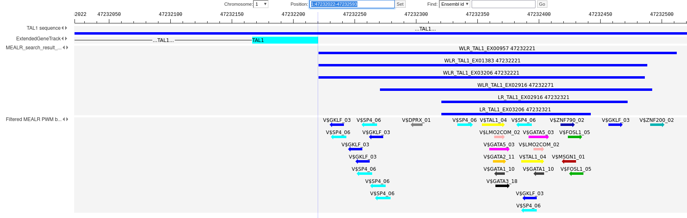
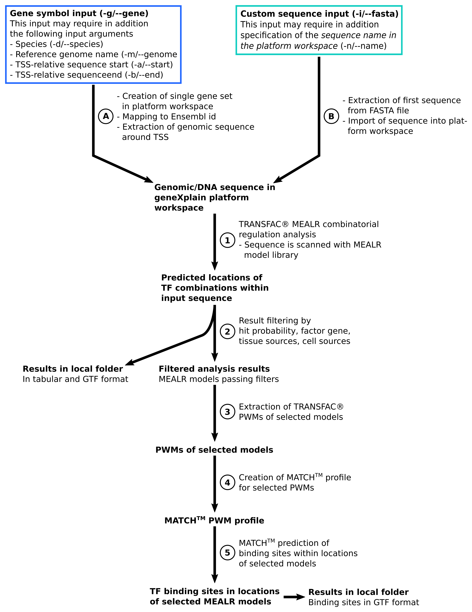

# Combinatorial regulation analysis with R

The [R](https://www.r-project.org/) script *transfac_mealr_search.R* implements
a workflow to analyze transcription factor binding sites within a single sequence
using [TRANSFAC&reg;](https://genexplain.com/transfac/) libraries of positional
weight matrices (PWMs) and MEALR combinatorial models.
Main analysis methods are provided by the [geneXplain platform](https://genexplain.com/genexplain-platform/).
The script connects to a platform webservice where analysis tasks are
carried out.
The workflow is depicted in the schema below and further explained in the following
text.


## Prerequisites

To use this script one needs

- R environment
- GeneXplain platform account, more information [here](https://genexplain.com/genexplain-platform/)
- TRANSFAC&reg; subscription, more information [here](https://genexplain.com/transfac/)


## R dependencies

The script uses the R libraries

- [geneXplainR](https://github.com/genexplain/geneXplainR)
- [optparse](https://cran.r-project.org/web/packages/optparse/index.html)
- [stringr](https://cran.r-project.org/web/packages/stringr/index.html)


## Example commandline

The following commandline analyzes the region from -2000 to +1000 around the
reference sequence of the TAL1 gene and subsequently extracts modules representing
TAL1 binding sites in blood.

*Note that some parts of the commandline need to be adapted to the individual user workspace.*

1. &lt;project name&gt; needs to be replaced by a valid project name
2. &lt;folder name&gt; needs to be replaced by a valid folder name within that project
3. &lt;username&gt; needs to be replaced by a valid username for login
4. &lt;password file&gt; needs to be replaced by a valid file path. Please see the description of the *-w/--passfile* option below.

```bash
Rscript transfac_mealr_search.R -g TAL1 \
--start -2000 \
--end 1000 \
-p data/Projects/<project name>/Data/<folder name> \
-u <username> \
-w <password file> \
-s https://platform.genexplain.com \
-y 0.99 \
-f TAL1 \
-t blood \
-r tal1_mealr_search \
-o tal1_mealr_search
```

The example result can be visualized in the genome viewer of the geneXplain platform web interface as shown
below. From top to bottom, the plot highlights

- The a part of the TAL1 genomic sequence selected by TSS-relative positions (-2000 to +1000),
- A part of the TAL1 gene structure
- The locations of MEALR model hits filtered by hit probability (&gt;0.99), the transcription factor *TAL1* and *blood* tissue
- The locations of individual DNA binding sites predicted by TRANSFAC&reg; PWMs of the models using MATCH<sup>TM</sup>

The best MEALR model hits were found upstream in close vicinity to the transcription start site (TSS), in a region extending
from the 47,232,221st to the 47,232,510th base pair.





## Options

The script prints out commandline options by invoking it with *-h* or *--help* as shown in the following shell code.

```bash
Rscript transfac_mealr_search.R -h
# or
Rscript transfac_mealr_search.R --help
```

<dl>
  <dt>-h or --help</dt>
  <dd>Show help message and exit</dd>
  
  <dt>-i or --fasta</dt>
  <dd>Input FASTA file</dd>
  
  <dt>-n or --name</dt>
  <dd>Designated name of sequence in the platform workspace. 
  This is the name of the sequence that will be uploaded into the output folder.
  &lbrack;default: mealr_search_input&rbrack;</dd>
  
  <dt>-g or --gene</dt>
  <dd>Input gene symbol</dd>
  
  <dt>-d or --species</dt>
  <dd>Species to associate with specified gene symbol &lbrack;default: Human (Homo sapiens)&rbrack;. Strings that can be specified for the species are listed in <i>Species</i> options <a href="https://platform.genexplain.com/#de=analyses/Methods/Data%20manipulation/Convert%20table">here</a></dd>
  
  <dt>-m or --genome</dt>
  <dd>Platform name of reference genome for specified gene &lbrack;default: Ensembl 104.38 Human (hg38)&rbrack;. 
  Available genomes are listed in the <i>Sequence source</i> options <a href="https://platform.genexplain.com/#de=analyses/Methods/Site%20analysis/TRANSFAC(R)%20Match(TM)%20for%20tracks">here</a></dd>
  
  <dt>-a or --start</dt>
  <dd>TSS-relative sequence start, for specified gene symbol &lbrack;default: -1000&rbrack;</dd>
  
  <dt>-b or --end</dt>
  <dd>TSS-relative sequence end, for specified gene symbol &lbrack;default: -100&rbrack;</dd>
  
  <dt>-r or --result</dt>
  <dd>Designated name of the search result folder in the platform workspace. This folder is created within the output folder (-p/--platform_out) &lbrack;default: mealr_search_result&rbrack;</dd>
  
  <dt>-o or --out</dt>
  <dd>Local output folder &lbrack;default: transfac_mealr_search_result&rbrack;</dd>
  
  <dt>-y or --prob</dt>
  <dd>Filter results for predictions with specified probability cutoff &lbrack;default: 0.99&rbrack;</dd>
  
  <dt>-f or --factor</dt>
  <dd>Filter results for specified factor gene symbol. Multiple can be specified separated by a pipe symbol (|)</dd>
  
  <dt>-c or --cell</dt>
  <dd>Filter results for specified cell source. Multiple can be specified separated by a pipe symbol (|)</dd>
  
  <dt>-t or --tissue</dt>
  <dd>Filter results for specified tissue source. Multiple can be specified separated by a pipe symbol (|)</dd>
  
  <dt>-e or --profile</dt>
  <dd>TRANSFAC&reg; reference profile. Score thresholds from this profile are used for binding 
  site prediction &lbrack;default: databases/TRANSFAC(R) 2022.2/Data/profiles/vertebrate_human_p0.001&rbrack;. 
  This profile should cover the vertebrate set of PWMs</dd>
  
  <dt>-p or --platform_out</dt>
  <dd>Output folder in the platform workspace. A string like 'data/Projects/&lt;project name>/Data/<subfolder(s)&gt;'.
  The folder is created if it does not exist. The parent folder is expected to be present</dd>
  
  <dt>-s or --server</dt>
  <dd>The platform server URL to connect with &lbrack;default: <i>https://platform.genexplain.com</i>&rbrack;</dd>
  
  <dt>-u or --user</dt>
  <dd>Platform user for login</dd>
  
  <dt>-q or --password</dt>
  <dd>Platform user's password for login</dd>
  
  <dt>-w or --passfile</dt>
  <dd>Source file with platform user's password for login to avoid giving the password on the commandline. 
  The source file contains a variable <i>gxpass</i> to which the password string is assigned like <i>gxpass <- &quot;password&quot;</i></dd>
</dl>


## Input parameters

### Sequence or gene input

The workflow starts out from a sequence provided within a FASTA sequence file (*-i* or *--fasta*) or a gene symbol (*-g* or *--gene*).
Given a FASTA file, only the first sequence is extracted and imported into the platform workspace. A name for the sequence
within the platform can be defined with *-n* or *--name*.
If a gene symbol is specified, the workflow may furthermore require information about the species (*-d* or *--species*) as well as
the reference genome sequence (*-m* or *--genome*) both of which point to human by default. Please note that valid parameters are
geneXplain platform-specific strings (see respective option descriptions for details). For a given gene, the workflow carries out
predictions in a genomic sequence region around the reference transcription start site (TSS) so that in addition one can choose
the range of this region by providing start and end points relative to the TSS (*-a* or *--start* and *-b* or *--end*).

### Filtering of MEALR combinatorial module predictions

Predictions of combinatorial module locations within the study sequence can be filtered by hit probability (*-y* or *--prob*),
transcription factor gene symbols associated with MEALR models (*-f* or *--factor*), cell sources (*-c* or *--cell*) and
tissue sources (*-t* or *--tissue*). Factor, cell and tissue sources correspond to the experimental conditions under which
the genomic binding sites were determined that served as training set for MEALR models. Multiple factors, cell types and tissues
can be specified separated by pipe symbol, e.g. &quot;RELA|IRF1|STAT1&quot;.

### PWM profile

PWMs of selected MEALR models are used to compile a MATCH<sup>TM</sup> profile to predict their binding sites
within combinatorial module locations. The score cutoff parameters for this profile are taken from a
reference profile (*-e* or *--profile*). The reference profile needs to cover the vertebrate set of TRANSFAC&reg;
PWMs and the provided argument is its path within the platform workspace.

## Outputs

The workflow generates outputs in a local folder (*-o* or *--out*) as well as in
a folder within the platform workspace (*-p* or *--platform_out*) and a subfolder therein (*-r* or *--result*).

The outputs consist of MEALR original and filtered search results in tabular and GTF formats as well as MATCH<sup>TM</sup>
binding site predictions in GTF format.

## Workflow description

The workflow starts out either from a gene specified by its gene symbol (A) or from a sequence provided
in a FASTA file (B). The input data are imported into the geneXplain platform workspace. The gene symbol
input is further processed to prepare a target sequence for subsequent predictions (A).

The target sequence is analyzed using the *TRANSFAC&reg; MEALR combinatorial regulation analysis* tool (1) which
applies a library of machine learning models trained on genome-wide binding site data to predict locations
of combinatorial regulatory modules in DNA sequences. The script configures the analysis to search for the **best hit**
of each MEALR model within the target sequence.

Combinatorial models of interest are selected by filtering for hit probability, factor, cell and tissue sources (2).
The underlying PWMs are extracted (3) and serve as basis to compile a profile of TRANSFAC&reg; PWMs (4).
This PWM profile is then applied by MATCH<sup>TM</sup> to obtain predictions about locations of individual factor
binding sites that comprise the selected combinatorial regulatory modules (5).


